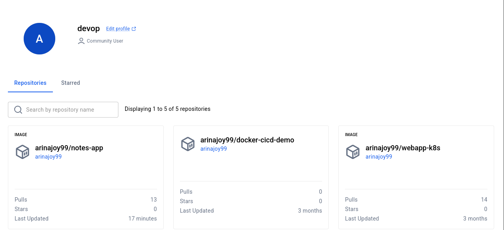
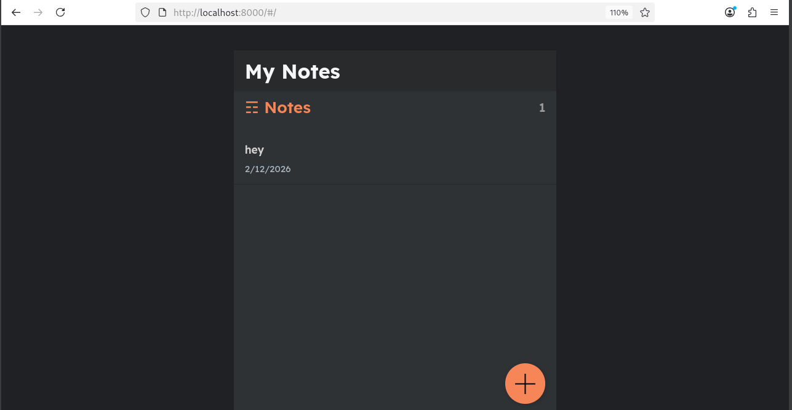
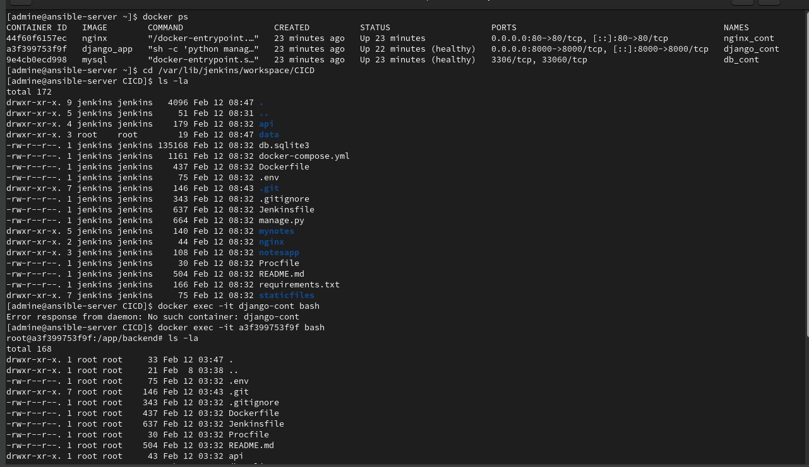
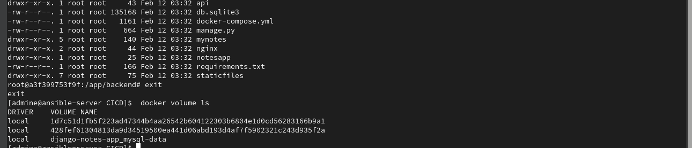

# 🚀 Django Notes App — CI/CD with Jenkins & Docker


---

## 📌 About This Project

Built an end-to-end **CI/CD pipeline** for a Django-based Notes Application using **Jenkins Pipeline-as-Code** with **Groovy Shared Libraries**. Automated Docker image builds, pushed artifacts to DockerHub, and deployed multi-container setup using Docker Compose — achieving full automation from source code commit to production deployment.

---

## 🏗️ CI/CD Flow

```
Code Push (GitHub)
       ↓
Jenkins Pipeline
       ↓
 ┌─────────────┐
 │  Code Clone │
 ├─────────────┤
 │Docker Build │
 ├─────────────┤
 │  DockerHub  │
 │    Push     │
 ├─────────────┤
 │   Deploy    │
 └─────────────┘
       ↓
App Running ✅
```

---

## 🛠️ Tech Stack

| Tool | Use |
|------|-----|
| Django | Web Application |
| Jenkins | CI/CD Server |
| Groovy Shared Libraries | Reusable Pipeline Code |
| Docker | Containerization |
| DockerHub | Image Registry |
| Docker Compose | Multi-Container Deploy |
| Nginx | Reverse Proxy |

---

## ✨ What This Pipeline Does

- **Code Clone** — Pulls latest code from GitHub automatically
- **Docker Build** — Builds Docker image from Dockerfile
- **DockerHub Push** — Tags and pushes image to DockerHub registry
- **Deploy** — Spins up containers using Docker Compose

---

## 📁 Project Structure

```
django-notes-app/
├── mynotes/              # Django App
├── notesapp/             # Django Settings
├── templates/            # HTML Templates
├── Dockerfile            # Docker Image Config
├── docker-compose.yml    # Container Orchestration
├── Jenkinsfile           # CI/CD Pipeline
└── requirements.txt      # Python Dependencies
```

---

## 🔁 Jenkins Shared Library

```
Shared/
└── vars/
    ├── clone.groovy         # Clone from GitHub
    ├── dockerbuild.groovy   # Build Docker Image
    ├── dockerpush.groovy    # Push to DockerHub
    └── deploy.groovy        # Deploy with Docker Compose
```

---

## 📝 Jenkinsfile

```groovy
@Library('Shared') _
pipeline {
    agent any
    stages {
        stage("Code Clone") {
            steps {
                clone("https://github.com/waqar-pro/django-notes-app.git", "main")
            }
        }
        stage("Docker Build") {
            steps {
                dockerbuild("notes-app", "latest")
            }
        }
        stage("Push to DockerHub") {
            steps {
                dockerpush("dockerHubCreds", "notes-app", "latest")
            }
        }
        stage("Deploy") {
            steps {
                deploy()
            }
        }
    }
}
```

---

## ⚙️ How to Run Locally

**Step 1 — Clone the repo**
```bash
git clone https://github.com/waqar-pro/django-notes-app.git
cd django-notes-app
```

**Step 2 — Run with Docker Compose**
```bash
docker compose up -d --build
```

**Step 3 — Open in browser**
```
http://localhost
```

---

## 🌐 Ports

| Service | Port |
|---------|------|
| Notes App (Nginx) | http://localhost |
| Django Direct | http://localhost:8000 |
| Jenkins | http://localhost:8080 |

---

## 👤 Author

**Waqar**  
[](https://github.com/waqar-pro)


---











